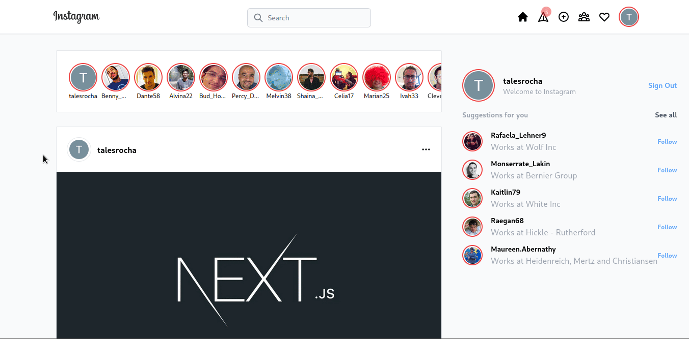

<a name="readme-top"></a>

[![Stargazers][stars-shield]][stars-url]
[![Issues][issues-shield]][issues-url]
[![MIT License][license-shield]][license-url]

<!-- PROJECT LOGO -->
<br />
<div align="center">

<H3 align="center">Instagram Clone</h3>

  <p align="center">
  An Instagram clone app.
    <br />
    <a href="https://instagram-clone-ec7xfmmbz-taleshrochaz-gmailcom.vercel.app/">View deploy</a>
    ·
    <a href="https://github.com/taleshrocha/instagram-clone/issues">Report Bug</a>
    ·
    <a href="https://github.com/taleshrocha/instagram-clone/issues">Request Feature</a>
  </p>
</div>

# About The Project


This is a <a href="https://www.instagram.com">Instagram</a> clone platform with <a href="https://firebase.google.com/">Firebase</a> integration
and <a href="https://next-auth.js.org/">NextAuth.js</a>.

<p align="right">(<a href="#readme-top">back to top</a>)</p>

### Built With

- [![javascript-badge]][javascript-url]
- [![tailwindcss-badge]][tailwindcss-url]
- [![react-badge]][react-url]
- [![next-badge]][next-url]
- [![firebase-badge]][firebase-url]

<p align="right">(<a href="#readme-top">back to top</a>)</p>

## Getting Started

To get a local copy up and running follow these simple example steps.

### Installation

1. Clone the repo
   ```sh
   git clone https://github.com/taleshrocha/instagram-clone.git
   ```
2. Install npm packages
   ```sh
   npm install
   ```

<p align="right">(<a href="#readme-top">back to top</a>)</p>

# Usage

## Up and Running

Run the application in localhost with

```sh
npm run dev
```

# Application

## Responsive Design

It has responsive design to allow a better experience to any user in any screen size. This was made easy by Tailwind breakpoints.


## Add Posts

It's possible to add Posts thanks to <a href="https://firebase.google.com/">Firebase</a>.


## Add Comments

It's possible to add comments to the Posts thanks to <a href="https://firebase.google.com/">Firebase</a>.



## Login

You can login with your Google account thanks to <a href="https://next-auth.js.org/">NextAuth.js</a>.


<p align="right">(<a href="#readme-top">back to top</a>)</p>

## License

Distributed under the MIT License. See `LICENSE` for more information.

<p align="right">(<a href="#readme-top">back to top</a>)</p>

## Acknowledgments

This project was possible thanks to [Sonny Sangha](https://www.youtube.com/watch?v=6fNy0iD3hsk&t=1s) on YouTube.

<div align="center">
<a href="https://github.com/taleshrocha">
 
 <br />
 <sub><b>Tales Rocha</b></sub></a>

Done with ❤️ by Tales Rocha 👋🏽 Contact me!

<p align="right">(<a href="#readme-top">back to top</a>)</p>

[contributors-shield]: https://img.shields.io/github/contributors/taleshrocha/move-it.svg?style=for-the-badge
[contributors-url]: https://github.com/taleshrocha/move-it/graphs/contributors
[forks-shield]: https://img.shields.io/github/forks/taleshrocha/move-it.svg?style=for-the-badge
[forks-url]: https://github.com/taleshrocha/move-it/network/members
[stars-shield]: https://img.shields.io/github/stars/taleshrocha/move-it.svg?style=for-the-badge
[stars-url]: https://github.com/taleshrocha/move-it/stargazers
[issues-shield]: https://img.shields.io/github/issues/taleshrocha/move-it.svg?style=for-the-badge
[issues-url]: https://github.com/taleshrocha/move-it/issues
[license-shield]: https://img.shields.io/github/license/taleshrocha/move-it.svg?style=for-the-badge
[license-url]: https://github.com/taleshrocha/move-it/blob/master/LICENSE.txt
[linkedin-shield]: https://img.shields.io/badge/-LinkedIn-black.svg?style=for-the-badge&logo=linkedin&colorB=555
[linkedin-url]: https://linkedin.com/in/linkedin_username
[next-badge]: https://img.shields.io/badge/next.js-000000?style=for-the-badge&logo=nextdotjs&logocolor=white
[next-url]: https://nextjs.org/
[vite-badge]: https://img.shields.io/badge/vite-20232a?style=for-the-badge&logo=vite
[vite-url]: https://vitejs.dev/
[react-badge]: https://img.shields.io/badge/react-20232a?style=for-the-badge&logo=react&logocolor=61dafb
[react-url]: https://reactjs.org/
[tailwindcss-badge]: https://img.shields.io/badge/tailwind%20css-20232A?style=for-the-badge&logo=tailwindcss
[tailwindcss-url]: https://tailwindcss.com/
[sanity-badge]: https://img.shields.io/badge/sanity-20232A?style=for-the-badge&logo=sanity
[sanity-url]: https://www.sanity.io/
[typescript-badge]: https://img.shields.io/badge/typescript-20232A?style=for-the-badge&logo=typescript
[typescript-url]: https://www.typescriptlang.org/
[javascript-badge]: https://img.shields.io/badge/javascript-20232A?style=for-the-badge&logo=javascript
[javascript-url]: https://www.javascript.com/
[firebase-badge]: https://img.shields.io/badge/firebase-20232A?style=for-the-badge&logo=firebase
[firebase-url]: https://firebase.google.com/
